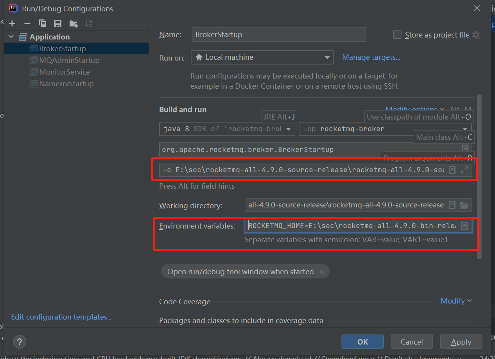
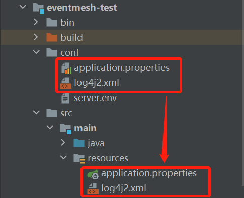

# 快速启动

## 一、项目定位

- EventMesh是一个动态的云原生事件驱动架构基础设施，它用于分离应用程序和后端中间件层，在业务层和基础结构层之间作为一个中间层的云原生的基础设施，它可以实现自动扩容以及对事件集中处理，还可以实现不同云原生下分布式的系统以及对消息的事件存储，后续还会支持更多的特性，比如云服务特性、数据实时计算等。
- EventMesh系统支持多语言接入和多协议接入。因为在实际业务中，不同业务之间边界性高，但是本系统可以打通业务之间壁垒，拓宽业务场景。

## 二、构建并部署event-store(RocketMQ)

关于RocketMQ更多的细节：

- 英文：https://github.com/apache/rocketmq/tree/master/docs/en
- 中文：https://github.com/apache/rocketmq/tree/master/docs/cn

### 2.1安装

#### 依赖

假设已经搭建完以下环境

```
64位操作系统，推荐使用Linux/Unix/Max;(Windows用户参阅下面指南)；
64位JDK 1.8+；
Maven 3.2.x；
Git；
4g+ 空磁盘提供给服务器使用
```

#### 下载地址

单击[此处](https://www.apache.org/dyn/closer.cgi?path=rocketmq/4.9.0/rocketmq-all-4.9.0-source-release.zip)下载4.9.0源版本。您也可以从[这里](https://www.apache.org/dyn/closer.cgi?path=rocketmq/4.9.0/rocketmq-all-4.9.0-bin-release.zip)下载二进制版本。

#### 构建源码

> 如果您下载的是二进制版本的源代码，可以直接省略构建源代码这一步骤。
>
> 在这里介绍用命令行构建二进制文件和使用idea在本地上构建二进制文件两种方法。

- 执行以下命令解压4.9.0源代码版本压缩包并构建二进制文件

```
  > unzip rocketmq-all-4.9.0-source-release.zip
  > cd rocketmq-all-4.9.0/
  > mvn -Prelease-all -DskipTests clean install -U
  > cd distribution/target/rocketmq-4.9.0/rocketmq-4.9.0
```

### 2.2Linux

#### 启动namesrv

在bin目录下打开终端，执行以下命令启动mqnamesrv

```
> sh mqnamesrv8888
```

显示以下代表是成功的：


#### 启动broker

在bin目录下打开终端，执行以下命令启动broker

```
> sh mqbroker -n localhost:9876
```

显示以下说明成功：


至此RocketMQ安装完毕。

#### 发送和接受信息

在发送/接收消息之前，我们需要配置客户端服务器的位置。RocketMQ 提供了多种方法来实现这一点。为简单起见，我们使用环境变量`NAMESRV_ADDR`

```
 > vi /etc/profile
 > source /etc/profile
 > export NAMESRV_ADDR=localhost:9876
 > sh bin/tools.sh org.apache.rocketmq.example.quickstart.Producer
 SendResult [sendStatus=SEND_OK, msgId= ...

 > sh bin/tools.sh org.apache.rocketmq.example.quickstart.Consumer
 ConsumeMessageThread_%d Receive New Messages: [MessageExt...
```

#### 关闭服务器

在bin目录下

```
> sh mqshutdown broker
The mqbroker(36695) is running...
Send shutdown request to mqbroker(36695) OK

> sh mqshutdown namesrv
The mqnamesrv(36664) is running...
Send shutdown request to mqnamesrv(36664) OK
```

### 2.3Windows

> 该指南用于Windows10，请确保您安装了powershell
>
> 下载最新版的二进制版本RocketMQ，并且将zip文件解压到本地磁盘中，如：`D:\rocketmq`

#### 添加环境变量

1. 在桌面上，右键单击计算机图标。
2. 从上下文菜单中选择属性。
3. 单击高级系统设置链接。
4. 单击环境变量。
5. 然后添加或更改环境变量。
6. 新建`ROCKETMQ_HOME`，配置`D:\rocketmq`

```
ROCKETMQ_HOME="D:\rocketmq"
```


- 或者只是在打开的powershell中，键入所需的环境变量。

```
$Env:ROCKETMQ_HOME="D:\rocketmq"
```

如果选择的是powershell方式，您应该为每一个新打开的powershell窗口都执行此操作。

#### 启动namesrv

设置正确的环境变量之后，打开新的powershell窗口，进入到`D:\rocketmq\bin`路径下输入`start mqnamesrv.cmd`，输入，成功后以下弹出提示框，此框请不要关闭。

```
start mqnamesrv.cmd
```


#### 启动broker

- 打开新的powershell窗口，进入到`D:\rocketmq\bin`路径下输入`start mqbroker.cmd -n 127.0.0.1:9876 autoCreateTopicEnable=true`，成功后弹出提示框，此框请不要关闭。

```
start mqbroker.cmd -n 127.0.0.1:9876 autoCreateTopicEnable=true
```


至此rocketmq安装完毕。

#### 发送和接收消息

**发送消息**

打开新的powershell窗口，进入到`D:\rocketmq\bin`路径下，并运行以下命令

```
start tools.cmd  org.apache.rocketmq.example.quickstart.Producer
```

**发送消息**

打开新的powershell窗口，进入到`D:\rocketmq\bin`路径下，并运行以下命令

```
start tools.cmd  org.apache.rocketmq.example.quickstart.Consumer
```

#### 关闭服务器

通常，您只需关闭这些 powershell 窗口即可。

### 2.4idea

> 首先您需要把maven的配置成为本地的maven；
>
> 在idea上打开项目，点击文件/设置/maven，配置maven主路径以及用户设置文件。配置成功之后，等待构建成功就可以了。

```
#配置maven主路径，就是您下载的rocketmq的路径，如
D:\apache-maven-3.2.5-bin\apache-maven-3.2.5
#配置用户设置文件，就是您下载的rocketmq路径/con/settings.xml，如：
D:\apache-maven-3.2.5-bin\apache-maven-3.2.5\conf\settings.xml
```


#### 配置环境变量

在idea上打开下载好的源代码文件，打开`/rocketmq/namesrv/src/main/java/NamesrvStartUp`和`/rocketmq/Broker/src/main/java/BrokerStartup`两个启动文件，点击下方配置环境变量。

```
ROCKETMQ_HOME=D:\rocketmq
```

>  注：如果是配置broker启动文件，还需要在程序参数中配置一个程序参数为`-c D:\rocketmq\conf\broker.conf`。这里要注意的是，新下载的源代码是没有conf目录下的内容的，所以这里需要新建一个conf目录，目录下需要添加`broker.conf`、`logback_namesrv.xml`、`logback_broker.xml`三个配置文件，内容可以参照`D:\rocketmq\distribution\conf\`目录下的三个对应的配置文件的内容。配置好之后，注意`logback_namesrv.xml`、`logback_broker.xml`两个配置文件的`${user.home}`要改为当前的运行路径。
>
>  ```
>  #broker.conf配置信息参考
>  brokerClusterName = DefaultCluster
>  brokerName = broker-a
>  brokerId = 0
>  # nameserver的地址
>  namesrvAddr=127.0.0.1:9876
>  deleteWhen = 04
>  fileReservedTime = 48
>  brokerRole = ASYNC_MASTER
>  flushDiskType = ASYNC_FLUSH
>  # 运行目录的store目录
>  storePathRootDir=/Users/shui/Desktop/rocketmq-nameserver/store
>  # commitLog的存储路径
>  storePathCommitLog=你的store目录/commitlog
>  # consume queue文件的存储路径
>  storePathConsumeQueue=你的store目录/consumequeue
>  # 消息索引文件的存储路径
>  storePathIndex=你的store目录/store/index
>  # checkpoint文件的存储路径
>  storeCheckpoint=你的store目录/checkpoint
>  # abort文件的存储路径
>  abortFile=你的store目录/abort
>  ```





#### 启动namesrv

直接运行`/rocketmq/namesrv/src/main/java/NamesrvStartUp`方法，成功之后打印提示语和成功的对象如下，表示启动成功。

```
The Name Server boot success. serializeType=JSON
```

#### 启动broker

直接运行`/rocketmq/Broker/src/main/java/BrokerStartup`方法，成功之后会出现提示语如下，表示启动成功。

```
The broker[broker-a, 192.168.72.1:10911] boot success. serializeType=JSON and name server is 127.0.0.1:9876
```

至此，RocketMQ安装完毕

#### 关闭服务器

结束运行方法即可。

### 2.5问题解决

1. **启动消息队列RocketMQ版的客户端时提示`UnknownHostException`异常信息。可以参照官方解决方案：[点击这里](https://help.aliyun.com/knowledge_detail/29638.html)**

2. **Linux出现内存不足，无法初始化，可以修改JVM配置，具体如下**：

```
 > vi runbroker.sh
```

修改`JAVA_OPT="${JAVA_OPT} -server`里面的Xms，Xmx和Xmn，按照自己虚拟机的配置情况修改

```
JAVA_OPT="${JAVA_OPT} -server -Xms1g -Xmx1g -Xmn1g"
```

同理

```
> vi runserver.sh
```

按照个人虚拟机的配置情况修改`JAVA_OPT="${JAVA_OPT} -server`

```
JAVA_OPT="${JAVA_OPT} -server -Xms1g -Xmx1g -Xmn1g -XX:MetaspaceSize=128m -XX:MaxMetaspaceSize=320m"
```

关闭终端，重新执行Linux安装命令。


3. **如果在启动broker的时候，提示框提示错误：找不到或者无法加载主类xxxx,解决方法如下：**

   打开`runbroker.cmd`然后将`%CLASSPATH%`加上英文双引号，保存并且重新执行start语句


## 三、构建并部署eventmesh-runtime

### 3.1开发者部署

#### 3.1.1依赖

```
64位 操作系统，推荐使用Linux/Unix
64位 JDK1.8+
Gradle7.0+，比如7.0.*
idea 2020+，比如2021版本的idea
```

#### 3.1.2下载

从https://github.com/apache/incubator-eventmesh下载源代码，你会得到**incubator-eventmesh-develop**

#### 3.1.3运行

- **项目结构说明**

  - eventmesh-common : eventmesh 通用类和方法模块
  - eventmesh-connector-api : eventmesh 连接器 api 定义模块
  - eventmesh-connector-rocketMQ: 一种基于eventmesh-connector-api的实现，该实现支持将RocketMQ作为事件存储，实现事件的发布与订阅
  - eventmesh-runtime : eventmesh 运行时模块
  - eventmesh-sdk-java : eventmesh java客户端sdk
  - eventmesh-spi : eventmesh SPI 加载模块
  - eventmesh-starter : eventmesh 项目本地启动入口
  - eventmesh-connector-plugin : eventmesh 连接器插件实例模块
  
  
  
  
  
  

> 注：插件模块遵循eventmesh定义的SPI规范, 自定义的SPI接口需要使用注解@EventMeshSPI标识. 插件实例需要在对应模块中的/main/resources/META-INF/eventmesh 下配置相关接口与实现类的映射文件,文件名为SPI接口全类名. 文件内容为插件实例名到插件实例的映射, 具体可以参考eventmesh-connector-rocketmq插件模块

插件可以从classpath和插件目录下面加载. 在本地开发阶段可以将使用的插件在eventmesh-starter模块build.gradle中进行声明,或者执行gradle的copyConnectorPlugin任务 将插件拷贝至dist/plugin目录下, eventmesh默认会加载项目下dist/plugin目录下的插件, 加载目录可以通过-DeventMeshPluginDir=your_plugin_directory来改变插件目录. 运行时需要使用的插件实例可以在eventmesh.properties中进行配置

**配置插件**

在`eventMesh.properties`配置文件通过声明式的方式来指定项目启动后需要加载的插件

修改`confPath`目录下面的`eventMesh.properties`文件

加载**RocketMQ Connector**插件配置：

```
#connector plugin 
eventMesh.connector.plugin.type=rocketmq
```

**配置VM启动参数**

在idea上打开`/eventmesh-starter/src/main/java/StatUp`，在main函数右边的绿色三角形点`修改运行配置`，在构建并运行中找到`修改选项`，点击添加`VM选项`，直接把下面配置信息复制进去。

```java
-Dlog4j.configurationFile=eventmesh-runtime/conf/log4j2.xml
-Deventmesh.log.home=eventmesh-runtime/logs
-Deventmesh.home=eventmesh-runtime
-DconfPath=eventmesh-runtime/conf
    
#Windows用户请配置以下信息   
-Dlog4j.configurationFile=eventmesh-runtime\conf\log4j2.xml 
-Deventmesh.log.home=eventmesh-runtime\logs 
-Deventmesh.home=eventmesh-runtime 
-DconfPath=eventmesh-runtime\conf
```

> 注：如果操作系统为Windows, 可能需要将文件分隔符换成\


**启动运行**

```
运行eventmesh-starter/src/main/java/StartUp的主要方法
```

运行成功后，我们看到日志文件这边会有提示说tcp和http的服务启动成功，而且会显示对应的端口号。启动成功后面是对应的检查文件。这个对应的端口在test模块下对应的配置文件中是可以找到的。


## 四、运行eventmesh-sdk-java演示

> Eventmesh-sdk-java作为客户端，与eventmesh-runtime通信，用于完成消息的发送和接收。
>
> Eventmesh-sdk-java支持异步消息和广播消息。异步消息表示生产者只发送消息，不关心回复消息。广播消息表示生产者发送一次消息，所有订阅广播主题的消费者都将收到消息。
>
> Eventmesh-sdk-java支持HTTP和TCP协议。

TCP 和 Http 示例都在**eventmesh-test**模块下


请注意：下载源代码后，需要将`/eventmesh-test/conf/application.properties` 和 `/eventmesh-test/conf/log4j2.xml` 复制到 `/eventmesh-test/src/main/resources` 目录下。实例如下：



### 4.1通过rocketmq-console创建主题

#### 4.1.1下载

[直接点击下载页面](https://github.com/apache/rocketmq-externals)

在code页面下的点击直接下载压缩包，或者通过克隆下载。

#### 4.1.2配置

进入‘`rocketmq-externals\rocketmq-console\src\main\resources`’文件夹，打开‘`application.properties`’进行配置。


#### 4.1.3编译启动

首先确保RocketMQ Namesrv & Broker启动成功

进入`\rocketmq-externals\rocketmq-console`文件夹

```
> mvn clean package -Dmaven.test.skip=true
BUILD SUCCESS……

> cd target
> java -jar rocketmq-console-ng-2.0.0.jar
```

最后一步是打开浏览器访问：[127.0.0.1：你配置的端口号]，比如`127.0.0.1:8089`

### 4.2 TCP DEMO

  #### 4.2.1异步消息

- 创建主题TEST-TOPIC-TCP-ASYNC,可以通过rocketmq-console

- 启动消费者，订阅上一步骤已经创建的Topic

```
运行org.apache.eventmesh.tcp.demo.AsyncSubscribe的主要方法
```

打开看到代码，上面显示的是监听的topic，下面是接受消息之后对出现的处理机制


启动成功之后，观察日志文件，它主要是使用命令字和eventmesh进行交互


- 启动发送端，发送消息

```
运行org.apache.eventmesh.tcp.demo.AsyncPublish的主要方法
```

我们看到这个方法中循环发送了5条消息，那我们在日志文件中应该就是会显示出来这个结果。如果正常发送消息后，接收端会对发送的消息做出响应的处理。


#### 4.2.1广播消息

- 创建主题TEST-TOPIC-TCP-BROADCAST,可以通过rocketmq-console

- 启动消费端，订阅上一步骤已经创建的Topic

```
运行org.apache.eventmesh.tcp.demo.AsyncSubscribeBroadcast的主要方法
```

- 启动发送端，发送广播消息

```
运行org.apache.eventmesh.tcp.demo.AsyncPublishBroadcast的主要方法
```

### 4.3 HTTP演示

> 对于http，eventmesh-sdk-java对对于异步事件实现了发送与订阅
>
> 在演示中，Java类`LiteMessage`的`content`字段表示一个特殊的协议，因此，如果您要使用eventmesh-sdk-java的http-client，则只需设计协议的内容并在同一时间提供消费者的应用程序。

#### 4.3.1异步事件

> 生产者将事件发送给下游即可，无需等待响应

- 创建主题TEST-TOPIC-HTTP-ASYNC,可以通过rocketmq-console

- 启动消费端，订阅Topic

  异步事件消费端为spring boot demo，运行demo即可启动服务并完成Topic订阅

```
运行org.apache.eventmesh.http.demo.sub.SpringBootDemoApplication的主要方法
```

- 启动发送端，发送消息

```
运行org.apache.eventmesh.http.demo.AsyncPublishInstance的主要方法
```


> 注意：这三个主题都是eventmesh自带的三个演示，如果想要演示其他的主题，也可以通过配置来演示不同的主题。

