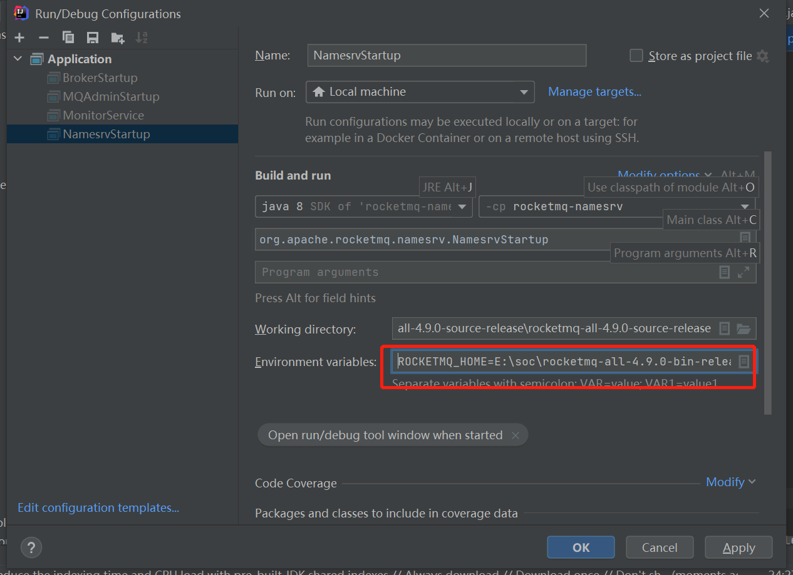
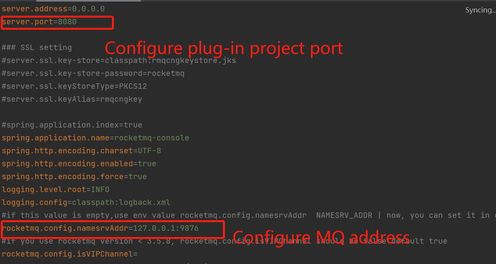
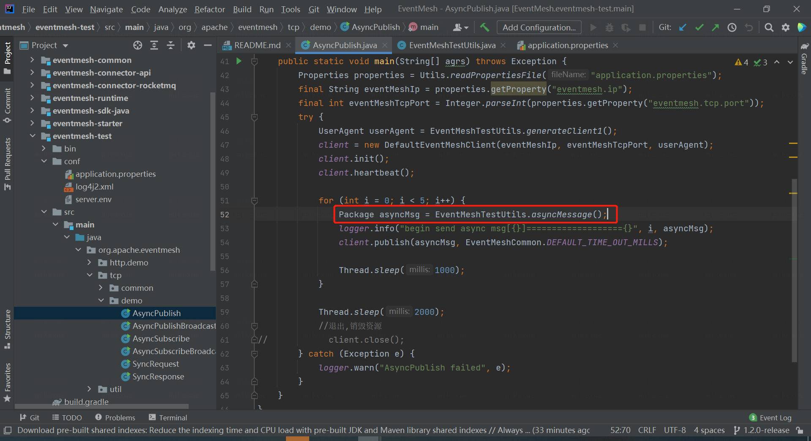

# Quicketstart

## 1、Project orientation

- Eventmesh is an event driven basic service. As a dynamic plug-in cloud native basic service layer, eventmesh separates the application layer from the middleware layer, and provides flexible, reliable and fast event distribution capabilities. At the same time, it can manage events and serve as the connection layer of application processes, Provide a complete set of application interprocess communication modes required by enterprises to achieve their digital transformation goals.


## 2、Build and deploy event store (rocketmq)

More details about rocketmq:

- English：https://github.com/apache/rocketmq/tree/master/docs/en
- Chinese：https://github.com/apache/rocketmq/tree/master/docs/cn

### 2.1 Install

#### Dependence

It is assumed that the following environment has been built

```
64 bit operating system, Linux/Unix/Max is recommended  (Windows userssee the guide below);
64 bit JDK 1.8 +;
4G+ empty disks are provided to the server；
```

#### Download address

Click [here](https://www.apache.org/dyn/closer.cgi?path=rocketmq/4.9.0/rocketmq -All-4.9.0-source-release. Zip)to download the 4.9.0 source version. You can also use [here](https://www.apache.org/dyn/closer.cgi?path=rocketmq/4.9.0/rocketmq -All-4.9.0-bin-release. Zip)to download the binary version.

#### Build source code

> If you download the binary version of the source code, you can directly omit the step of building the source code.

If you want to do this, you need to rely on：

```
Maven 3.2.x；
Git；
```

Execute the following command to unzip the 4.9.0 source code version package and build the binaries.

```
  > unzip rocketmq-all-4.9.0-source-release.zip
  > cd rocketmq-all-4.9.0/
  > mvn -Prelease-all -DskipTests clean install -U
  > cd distribution/target/rocketmq-4.9.0/rocketmq-4.9.0
```

### 2.2 Linux

#### Start namesrv

Open the terminal in the bin directory and execute the following command to start mqnamesrv

```
> sh mqnamesrv8888
```

Show that the following representatives are successful:


#### Start broker

Open the terminal in the bin directory and execute the following command to start the broker

```
> sh mqbroker -n localhost:9876
```

Show that the following representatives are successful:


So far, rocketmq has been installed.

#### Send and receive messages

Before sending/receiving messages, we need to configure the location of the client server. Rocketmq provides several ways to do this. For simplicity, we use environment variables`NAMESRV_ADDR`

```
 > vi /etc/profile
 > source /etc/profile
 > export NAMESRV_ADDR=localhost:9876
 > sh bin/tools.sh org.apache.rocketmq.example.quickstart.Producer
 SendResult [sendStatus=SEND_OK, msgId= ...

 > sh bin/tools.sh org.apache.rocketmq.example.quickstart.Consumer
 ConsumeMessageThread_%d Receive New Messages: [MessageExt...
```

#### Shut down the server

In the bin directory

```
> sh mqshutdown broker
The mqbroker(36695) is running...
Send shutdown request to mqbroker(36695) OK

> sh mqshutdown namesrv
The mqnamesrv(36664) is running...
Send shutdown request to mqnamesrv(36664) OK
```

### 2.3 Windows

> This guide is for windows 10, please make sure you have PowerShell installed
>
> Download the latest binary version of rocketmq, and extract the zip file to the local disk, such as:`D:\rocketmq`

#### Add environment variable

1. On the desktop, right-click the computer icon.
2. Select properties from the context menu.
3. Click the Advanced system settings link.
4. Click Environment Variables.
5. Then add or change Environment Variables.
6. build `ROCKETMQ_HOME`，configure`D:\rocketmq`

```
ROCKETMQ_HOME="D:\rocketmq"
```


- Or just type the required environment variables in the open PowerShell.

```
$Env:ROCKETMQ_HOME="D:\rocketmq"
```

If you choose PowerShell mode, you should do this for each newly opened PowerShell window.

#### Start namesrv

After setting the correct environment variables, open a new PowerShell window, enter the path`D:\rocketmq\bin` and enter`start mqnamesrv.cmd`. After the input is successful, the following prompt box will pop up. Please do not close this box.

```
start mqnamesrv.cmd
```


#### Start broker

- Open a new PowerShell window, enter the path`D:\rocketmq\bin`, ente`start mqbroker.cmd -n 127.0.0.1:9876 autoCreateTopicEnable=true`, and a prompt box will pop up after success. Please do not close this box.

```
start mqbroker.cmd -n 127.0.0.1:9876 autoCreateTopicEnable=true
```


At this point, the rocketmq installation is complete.

#### Send and receive messages

**Send messages**

Open a new PowerShell window, enter the`D:\rocketmq\bin`path, and run the following command

```
start tools.cmd  org.apache.rocketmq.example.quickstart.Producer
```

**Receive messages**

Open a new PowerShell window, enter the`D:\rocketmq\bin`path, and run the following command

```
start tools.cmd  org.apache.rocketmq.example.quickstart.Consumer
```

#### Shut down the server

Typically, you just need to close these PowerShell windows.

### 2.4 idea

> First, you need to configure Maven as a local Maven;
>
> Open the project on idea, click `file/settings /maven`, and configure Maven main path and user settings file. After the configuration is successful, wait for the build to succeed.
>
> #Configure the Maven main path, which is the path of the rocketmq you downloaded, such as `D:\apache-maven-3.2.5-bin\apache-maven-3.2.5`
> #The configuration user settings file is the rocketmq path you `downloaded\con\settings.xml`，such as：`D:\apache-maven-3.2.5-bin\apache-maven-3.2.5\conf\settings.xml`


#### Configure environment variables

Open the downloaded source code file on idea, and then open the two startup files`/rocketmq/namesrv/src/main/java/NamesrvStartUp` and`/rocketmq/Broker/src/main/java/BrokerStartup`,  click  to configure environment variables.

```
ROCKETMQ_HOME=D:\rocketmq
```

>  Ps: if you are configuring the broker startup file, you also need to configure a program parameter in the program parameters as`-c D:\rocketmq\conf\broker.conf`. It should be noted that the newly downloaded source code has no content in the conf directory, so a new conf directory needs to be created, and three configuration files need to be added under the directory: `broker.conf`、`logback_namesrv.xml`、`logback_broker.xml`. The contents can refer to the contents of the three corresponding configuration files under the directory`D:\rocketmq\distribution\conf\`. After configuration, note that the `${user.home}`of the two configuration files like `logback_namesrv.xml`、`logback_broker.xml` should be changed to the current running path.
>
>  ```
>  # broker.conf configuration information reference
>  brokerClusterName = DefaultCluster
>  brokerName = broker-a
>  brokerId = 0
>  # address of nameserver
>  namesrvAddr=127.0.0.1:9876
>  deleteWhen = 04
>  fileReservedTime = 48
>  brokerRole = ASYNC_MASTER
>  flushDiskType = ASYNC_FLUSH
>  # store directory of the running directory
>  storePathRootDir=/Your rocketmq directory/store
>  # storage path of commitlog
>  storePathCommitLog=Your store directory/commitlog
>  # storage path of consume queue
>  storePathConsumeQueue=Your store directory/consumequeue
>  # storage path of index
>  storePathIndex=Your store directory/store/index
>  # storage path of checkpoint
>  storeCheckpoint=Your store directory/checkpoint
>  # storage path of abort
>  abortFile=Your store directory/abort
>  ```




#### Start namesrv

Directly run the `/rocketmq/namesrv/src/main/java/NamesrvStartUp`method. After success, the prompt and successful object are printed as follows, indicating successful startup.

```
The Name Server boot success. serializeType=JSON
```

#### Start broker

Directly run the`/rocketmq/Broker/src/main/java/BrokerStartup`method. After success, the prompt and successful object are printed as follows, indicating successful startup.

```
The broker[broker-a, 192.168.72.1:10911] boot success. serializeType=JSON and name server is 127.0.0.1:9876
```

So far, rocketmq has been installed.

#### Shut down the server

Just end the operation method.

### 2.5 Problem solving

1. **When starting the client of message queue rocketmq, you will be prompted with "unknownhostexception" exception information. You can refer to the official solution: [click here]( https://help.aliyun.com/knowledge_ detail/29638.html).**
2. **Linux cannot initialize due to insufficient memory. You can modify the JVM configuration as follows **:

```
 > vi runbroker.sh
```

Modify `JAVA_OPT="${JAVA_OPT} -server` are modified according to their own virtual machine configuration.

```
JAVA_OPT="${JAVA_OPT} -server -Xms1g -Xmx1g -Xmn1g"
```

Similarly

```
> vi runserver.sh
```

Modify according to personal virtual machine configuration ` Java_ OPT="${JAVA_ OPT} -server`

```
JAVA_OPT="${JAVA_OPT} -server -Xms1g -Xmx1g -Xmn1g -XX:MetaspaceSize=128m -XX:MaxMetaspaceSize=320m"
```

Close the terminal and re execute the Linux Installation command.


3. **If the prompt box prompts an error when starting the Broker: the main class XXXX cannot be found or loaded, the solution is as follows:**
Open`runbroker.cmd`, then put `%CLASSPATH%`in English double quotation marks, save and re execute the start statement.


## 3、Build and deploy eventmesh runtime

### 3.1 Developer deployment

#### 3.1.1 dependence

```
64 bit operating system, Linux/unix64 bit is recommended;
JDK1.8+;
Gradle7.0+,such as 7.0.*;
idea 2020+,for example, the 2021 version of idea;
```

#### 3.1.2 Download

From [hear](https://github.com/apache/incubator-eventmesh ) to download the source code and you will get  **incubator-eventmesh-develop**

#### 3.1.3 Run

- **Project structure description**

  - eventmesh-common : eventmesh generic class and method module;
  - eventmesh-connector-api : eventmesh connector API definition module;
  - eventmesh-runtime : eventmesh runtime module;
  - eventmesh-sdk-java : eventmesh java client sdk;
  - eventmesh-spi : eventmesh SPI loading module;
  - eventmesh-starter : eventmesh project local startup portal;
  - eventmesh-connector-plugin : eventmesh connector plug-in instance module;
  

  

  


> ps: the plug-in module follows the SPI specification defined by eventmesh, and the customized SPI interface needs to be identified with the annotation @ eventmeshspi. The plug-in instance needs to configure the mapping file between the relevant interface and the implementation class under `/main/resources/META-INF/eventmesh ` in the corresponding module. The file name is the full class name of the SPI interface. The file content is the mapping from the plug-in instance name to the plug-in instance, For details, please refer to the `eventmesh-connector-rocketmq`plug-in module.

Plug ins can be loaded from classpath and plug-in directory. In the local development stage, you can declare the plug-ins used in eventmesh starter module build.gradle, or execute gradle's copyconnectorplugin task to copy the plug-ins to` dist / plugin` directory. Eventmesh will load the plug-ins in `dist / plugin` directory under the project by default, You can load the directory through`-DeventMeshPluginDir=your_plugin_directory` to change the plug-in directory. The plug-in instances that need to be used at runtime can be configured in eventmesh.properties

**Configure plugin**

There is no need to manually configure the plug-in here. It has been configured.

Specify the connector plugin that will be loaded after the project start by declaring in`runtime/conf/eventMesh.properties`.

Modify the `eventMesh.properties` file in the `conf` directory.

load **rocketmq connector** configuration：

```
#connector plugin 
eventMesh.connector.plugin.type=rocketmq
```

**Configure VM startup parameters**

> Open `/eventmesh-starter/src/main/java/StatUp`on idea, click`modify run configuration`on the green triangle on the right of the main function, find`modify option`during construction and run, click Add`VM option`, and  copy the following configuration information directly.

```
-Dlog4j.configurationFile=eventmesh-runtime/conf/log4j2.xml
-Deventmesh.log.home=eventmesh-runtime/logs
-Deventmesh.home=eventmesh-runtime
-DconfPath=eventmesh-runtime/conf
    
#Please configure the following information for Windows users
-Dlog4j.configurationFile=eventmesh-runtime\conf\log4j2.xml 
-Deventmesh.log.home=eventmesh-runtime\logs 
-Deventmesh.home=eventmesh-runtime 
-DconfPath=eventmesh-runtime\conf
```

> ps: If you use Windows, you may need to replace the file separator to \


**Run**

```
run eventmesh-starter/src/main/java/StartUp
```

After running successfully, we will see a prompt in the log file saying that the TCP and HTTP services are started successfully, and the corresponding port number will be displayed. Successful startup is followed by the corresponding inspection file. The corresponding port can be found in the corresponding configuration file under the test module.


## 4、Run eventmesh-sdk-java

> As a client, Eventmesh-sdk-java communicates with eventmesh-runtime used to complete the sending and receiving of messages.
>
> Eventmesh-sdk-java supports async msg and broadcast msg. Asynchronous message, it means the producer just sends message and does not care reply massage.Broadcast massage means the producer send massage once and all the consumer subscribed the broadcast topic will receive the massage.
>
> Eventmesh-sdk-java supports  the protocol  of HTTP and TCP.

TCP demos and Http demos are both under the **eventmesh-test** module.

**prerequisite**：

after download the source code, you should copy `/conf/application.properties` and `/conf/log4j2.xml` to the `resources` directory


### 4.1 Creating themes through rocketmq console

#### 4.1.1 Install

[Click to jump to the download page]( https://github.com/apache/rocketmq-externals )

Click on the code page to download the compressed package directly or through cloning.

#### 4.1.2 Configure

Enter the`rocketmq-externals\rocketmq-console\src\main\resources`folder and open`application.properties` for configuration.



#### 4.1.3 Compile and start

First, ensure that rocketmq namesrv &amp; broker is started successfully

Enter the `\rocketmq-externals\rocketmq-console` folder

```
> mvn clean package -Dmaven.test.skip=true
BUILD SUCCESS……

> cd target
> java -jar rocketmq-console-ng-2.0.0.jar
```

The last step is to open the browser to access: [127.0.0.1: your configured port number], such as ` 127.0.0.1:8089`.

Then you can directly create the desired topic under`topic`.

### 4.2 TCP DEMO

  #### 4.2.1 Async msg

- create topic TEST-TOPIC-TCP-ASYNC on rocketmq-console
- start consumer ,subscribe topic in previous step.

```
Run the main method of org.apache.eventmesh.tcp.demo.AsyncSubscribe
```

Open the code to see the listening topic. The following is the processing mechanism for the occurrence after receiving the message.


After successful startup, observe the log file. It mainly uses command words to interact with eventmesh. Each method to be executed will have a corresponding command.


- start producer, send message

```
Run the main method of org.apache.eventmesh.tcp.demo.AsyncPublish
```

- We see that five messages are sent circularly in this method, and we should display this result in the log file. If the message is sent normally, the receiving end will respond to the sent message.




#### 4.2.2 Broadcast msg

- create topic TEST-TOPIC-TCP-BROADCAST on rocketmq-console

- start consumer ,subscribe topic in previous step.

```
Run the main method of org.apache.eventmesh.tcp.demo.AsyncSubscribeBroadcast
```

* start producer, send broadcast message

```
Run the main method of org.apache.eventmesh.tcp.demo.AsyncPublishBroadcast
```

### 4.3 HTTP DEMO

> As to http, eventmesh-sdk-java implements  the pub and sub for async event .
>
> In the demo ,the field of `content` of the java class `LiteMessage` represents a special protocal, so if you want to use http-client of eventmesh-sdk-java, you just need to design the content of protocal and supply the consumer appliacation at the same time.

#### 4.3.1 Async event

> producer send the event to consumer and don't need waiting response msg from consumer

- create topic TEST-TOPIC-HTTP-ASYNC on rocketmq-console

- start consumer, subscribe topic

  Async consumer demo is a spring boot application demo, you can easily run this demo to start service and subscribe the
  topic.

```
Run the main method of org.apache.eventmesh.http.demo.sub.SpringBootDemoApplication
```

- start producer, produce msg

```
Run the main method of org.apache.eventmesh.http.demo.AsyncPublishInstance
```


> Note: these three topics are the three demonstrations provided by eventmesh. If you want to demonstrate other topics, you can also demonstrate different topics through configuration.

